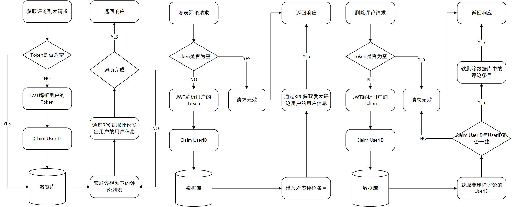

# Simple-Douyin
Simple Douyin is a project imitated from ByteDance's Douyin（Tiktok）

[演示视频](https://www.bilibili.com/video/BV1fT411U7pp/?vd_source=f4f2c590094c8dc71490eeb6ebf221d4#reply482279173)

# 项目特征
1. 采用开源 HTTP 框架 Hertz、开源 RPC 框架（Kitex）及开源 ORM 框架 GORM 开发，基于 RPC 微服务 + Hertz 提供 HTTP 服务 + GORM 实现 ORM

2. 基于《接口文档在线分享- Apifox》提供的接口进行开发，使用《极简抖音App使用说明 - 青训营版 》提供的APK进行Demo测试， 功能完整实现 ，前端接口匹配良好。

3. 代码结构采用 (HTTP API 层 + RPC Service 层 + Dal 层) 项目结构清晰 ，代码符合规范

4. 使用 JWT 进行用户token的校验

5. 使用 ETCD 进行服务发现和服务注册；

6. 使用 Gorm 对 MySQL 进行 ORM 操作；

7. 使用 Hertz 中间件 tracer 实现链路跟踪；

8. 使用 Pprof 中间件实现代码性能检测

9. 使用 Redis 中间件作为数据库缓存

# 环境搭建
- go1.19.5 linux/amd64
- hertz v0.5.2
- kitex v0.4.4

# 快速开始
1. Edit pkg/constant.go to config your project

2. Setup basic dependency(please install docker & docker-compose previously)
```shell
make start
```

3. run user service
```shell
cd cmd/user
sh build.sh
sh output/bootstrap.sh
```

4. run feed service
```shell
cd cmd/feed
sh build.sh
sh output/bootstrap.sh
```

5. run publish service
```shell
cd cmd/publish
sh build.sh
sh output/bootstrap.sh
```

6. run comment service
```shell
cd cmd/comment
sh build.sh
sh output/bootstrap.sh
```

7. run favorite service
```shell
cd cmd/favorite
sh build.sh
sh output/bootstrap.sh
```

8. run relation service
```shell
cd cmd/relation
sh build.sh
sh output/bootstrap.sh
```

9. run message service
```shell
cd cmd/message
sh build.sh
sh output/bootstrap.sh
```

10. run api service
```shell
cd cmd/api
go build
./api
```

# 各服务流程图

1. Publish 服务

publishList获取视频列表流程图：
<center>

</center>

2. Favorite 服务

favoriteAction点赞流程图：
<center>

</center>


favoriteList获取点赞列表流程图：
<center>

</center>

3. Comment 服务

Comment服务流程图：包含三种服务：获取评论列表、发表评论、删除评论
<center>

</center>

4. Relation 服务

Relation 服务流程图：包含五种服务：获取关注/粉丝/好友列表、关注用户、取关用户
<center>

</center>

5. Feed 服务

Feed 服务流程图：
<center>

</center>

6. Message 服务

Message服务流程图：包含消息发送和消息历史查询
<center>

</center>

# 参考文档

《抖音项目方案说明》：[抖音项目方案说明](https://bytedance.feishu.cn/docs/doccnKrCsU5Iac6eftnFBdsXTof#6QCRJV)

《接口文档在线分享- Apifox》：[接口文档在线分享- Apifox](https://www.apifox.cn/apidoc/shared-09d88f32-0b6c-4157-9d07-a36d32d7a75c)

《极简抖音App使用说明 - 青训营版 》：[极简抖音App使用说明 - 青训营版](https://bytedance.feishu.cn/docs/doccnM9KkBAdyDhg8qaeGlIz7S7)

# 特别鸣谢
[字节跳动青训营](https://youthcamp.bytedance.com/)